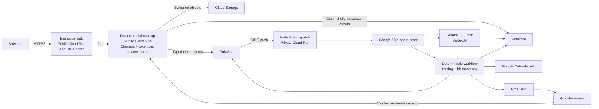

# FirstNotice Dispatch

An event-driven insurance intake coordinator that reasons over multimodal evidence, pauses for missing information or human review, and automatically resumes to schedule inspections and hand the claim to an adjuster.

> Built for the Taskmaster track of the All Things Agentic Hackathon. FirstNotice coordinates first-mile intake and routing; it does not adjudicate insurance claims.

## The problem

The hard part of first notice of loss is not merely extracting fields from a photograph or report. Claims arrive incomplete, evidence appears later, conflicts sometimes require a person, and downstream actions span several systems. A useful coordinator must preserve state across those pauses, resume the same claim from external events, and perform the next safe action without asking the claimant to drive every internal step.

## What FirstNotice does

```text
Claim submitted
→ multimodal intake
→ evidence review and gap detection
→ missing evidence? pause and resume on upload
→ consequential conflict? pause and resume on human decision
→ inspection scheduling
→ adjuster handoff
```

This is not a chatbot. The claimant starts a workflow; FirstNotice coordinates durable state, specialized reasoning, deterministic routing, external evidence, human checkpoints, Calendar scheduling, and Gmail delivery.

## Why this fits Taskmaster

- **Event-driven:** typed Pub/Sub events wake work at durable boundaries.
- **Long-running and stateful:** Firestore preserves claim state across browser sessions, service restarts, evidence waits, and human review.
- **Autonomous routing:** deterministic guardrails loop through `awaiting_documents` until current evidence is sufficient, then enter `inspection_ready` for an adjuster inspection decision.
- **Multiple actors and systems:** claimant, Angular, Cloud Run, Cloud Storage, Firestore, Pub/Sub, ADK, Vertex AI, Calendar, Gmail, and an adjuster participate asynchronously.
- **Real actions:** the workflow creates a Google Calendar inspection and sends Gmail messages.
- **Meaningful human decision:** routine evidence gaps and safely resolvable conflicts remain self-service; the adjuster authorizes inspection only after autonomous intake is complete.
- **Heavy lifting after one request:** no user guides each internal agent or manually resumes the workflow.

See [Taskmaster mapping](docs/TASKMASTER.md) for a criterion-by-criterion account.

## Key demo scenarios

### Missing evidence

A damage photo has useful damage evidence but no readable vehicle identity. FirstNotice records the gap and pauses at `awaiting_documents`. The claimant uploads one clear license-plate image. That event validates compatible evidence capabilities, resumes the same claim, and reaches `inspection_ready`. After the adjuster authorizes inspection, the existing Calendar and final Gmail dispatch reaches `adjuster_notified`.

### Inspection decision

FirstNotice resolves ordinary discrepancies directly with the claimant. Once current evidence is sufficient and consistent, the claim reaches `inspection_ready`. Gmail sends one secure inspection-decision link; **Approve Inspection** publishes the existing dispatch boundary, while **Request More Info** converts the adjuster's natural-language instruction into one validated claimant action.

Use the practical [demo operator guide](DEMO.md) and [three-minute narration](docs/DEMO_SCRIPT.md).

## Architecture



The deployed topology was verified on August 7, 2026:

- `firstnotice-web`: public; runtime API URL only; no credentials.
- `firstnotice-claimant-api`: public for the controlled demo; runs as `firstnotice-runtime`.
- `firstnotice-dispatch`: private; only the Pub/Sub push service account has Cloud Run Invoker.
- Pub/Sub pushes to `/events/pubsub` on the private service using OIDC.
- Gmail OAuth values are mounted from Secret Manager only on the private dispatch service.

For sequences, state transitions, storage, and trust boundaries, see [Architecture](docs/ARCHITECTURE.md).

## Google technologies used

| Technology | What it does | Why it is used |
|---|---|---|
| Gemini 3.5 Flash on Vertex AI | Multimodal intake, evidence review, narrow new-document quality checks, and structured adjuster-summary drafting | Understands images and PDFs while returning Pydantic-validated structured output; Vertex AI uses Google Cloud identity and billing |
| Google Agent Development Kit | Runs the intake specialist, review specialist, and state-aware coordinator | Makes agent responsibilities and stop boundaries explicit without replacing deterministic routing |
| Cloud Run | Hosts the Angular web container, public claimant API, and private event processor | Separates browser exposure from privileged workflow execution and scales for a short-lived demo workload |
| Pub/Sub | Delivers typed claim lifecycle events | Decouples HTTP acceptance from processing and lets missing-document or human-review events resume work later |
| Firestore | Stores claims, timeline events, documents metadata, processed-event records, reviews, appointments, and idempotency reservations | Provides the durable source of truth required for long-running pause/resume behavior |
| Cloud Storage | Stores uploaded image, PDF, and audio evidence | Keeps raw evidence out of Firestore and Pub/Sub while allowing Vertex AI to read GCS URIs |
| Google Calendar API | Creates the deterministic inspection event | Demonstrates a real downstream operational action |
| Gmail API | Sends secure review requests and final adjuster handoffs | Demonstrates real asynchronous human coordination and external communication |
| Cloud Build + Artifact Registry | Builds and stores the Angular/nginx container | Provides a repeatable Cloud Run frontend build without local Docker dependency |
| Secret Manager | Supplies Gmail OAuth client ID, client secret, and refresh token to private dispatch | Keeps OAuth credentials out of source, Angular, and the public API |

## Agent and workflow responsibilities

**Intake Agent**

- Sends the submitted image/PDF/audio evidence to Gemini through Vertex AI.
- Produces a structured `IntakeResult` with evidence provenance and capability observations.

**Review Agent**

- Uses Gemini for evidence quality, completeness, and grounded conflict analysis.
- Returns a validated `ReviewResult`; it does not own final routing authority.

**Deterministic workflow**

- Applies the required-evidence checklist and safety guardrails.
- Owns claim-state transitions, idempotency, pause/resume boundaries, and whether automation may continue.
- Prevents routine missing evidence from becoming urgent human review.

**Dispatch**

- Selects an inspection slot deterministically.
- Creates the idempotent Calendar event, adjuster-ready packet, and Gmail handoff.

## Event-driven workflow

The primary event contract is defined in `backend/app/events/claim_events.py`:

| Event | Purpose |
|---|---|
| `claim.submitted` | Start intake and review after the API has durably created the claim and evidence metadata |
| `claim.document.received` | Inspect new evidence and resume an awaiting claim |
| `claim.human_review.approved` | Start inspection dispatch after an adjuster authorizes inspection |
| `claim.human_review.correction_requested` | Route an adjuster's constrained information request to the claimant |
| `claim.correction.received` | Resume after the claimant supplies a requested correction |
| `claim.inspection.ready` | Wake the existing dispatch workflow after durable state reaches `inspection_pending` |

For each delivery: reserve the event ID → load durable claim state → run only the eligible workflow → persist state/events → emit the next deterministic event when appropriate. Redelivery is expected and handled as a no-op or retry according to the processed-event record.

## Reliability

- Client submission keys are hashed and atomically reserved in Firestore before uploads.
- Typed events carry deterministic or stable IDs, version, correlation ID, source, and UTC timestamp.
- `processed_events` records receipt, attempts, completion, retryable failure, and duplicate delivery.
- The inspection-ready event ID is deterministic: `{claimId}:inspection-ready:v1`.
- Appointment, Calendar, dispatch, notification, and human-review IDs derive from stable workflow keys.
- Calendar handles duplicate creation by reading the existing deterministic event.
- Durable state is reloaded before emitting the inspection-ready boundary, including duplicate recovery.
- Resume checks never schedule from `awaiting_documents`, `inspection_ready`, or `human_review_required`; only an idempotent approval may move `inspection_ready` to `inspection_pending`.
- Gmail uses a deterministic message ID and Firestore notification record. It cannot promise provider-level exactly-once delivery if Gmail accepts a send and the process fails before persistence; a retry could send again.

## Security

- The Pub/Sub receiver lives only on private `firstnotice-dispatch`; neither public service exposes `/events/pubsub`.
- Pub/Sub invokes dispatch using a dedicated OIDC service account.
- The browser sees only the public claimant API URL—no ADC, API key, OAuth secret, or service-account material is bundled.
- Gmail OAuth values come from Secret Manager and are attached only to private dispatch.
- Raw evidence is stored in GCS; Pub/Sub carries document IDs, not evidence bytes.
- Firestore stores structured extraction and file metadata rather than raw images/PDF/audio.
- Human-review tokens are random, expiration-bound, stored as hashes, consumed atomically, and sent to the API in a header. The Angular hash route keeps the token out of nginx request paths, and frontend access logging is disabled.
- CORS uses explicit origins and never `*`.

**Demo limitation:** claimant endpoints are intentionally unauthenticated for the hackathon. Production would require consumer identity, claim-level authorization, rate limiting, upload malware controls, and stronger abuse protection.

## Safety and product boundary

FirstNotice performs intake, evidence coordination, operational routing, inspection scheduling, and adjuster handoff.

It does **not**:

- approve or deny an insurance claim;
- determine liability or coverage;
- make a fraud conclusion;
- calculate a payout; or
- close the insurance claim.

`adjuster_notified` means the FirstNotice first-mile orchestration is complete—not that the insurance claim is decided.

## Screenshots and demo video

Screenshot locations are reserved under [`docs/screenshots/`](docs/screenshots/README.md):

- claimant submission;
- awaiting evidence;
- Agent Activity;
- secure human review;
- Calendar event; and
- Gmail handoff.

No screenshots are fabricated or committed yet.

**Demo video: TODO before submission**

## Repository layout

```text
.
├── README.md
├── DEMO.md
├── backend/                 # FastAPI, ADK, event handler, workflows, integrations, tests
├── frontend/                # Angular standalone application and nginx Cloud Run container
├── sample-data/             # Synthetic/rights-reviewed demo inputs only
└── docs/
    ├── ARCHITECTURE.md
    ├── DEMO_SCRIPT.md
    ├── TASKMASTER.md
    └── screenshots/
```

## Local development

Prerequisites: Python 3.11+, Node.js 22+, Google Cloud CLI, ADC, and access to the configured Google Cloud resources.

```bash
gcloud auth application-default login
gcloud config set project firstnotice-ai

cd backend
python3 -m venv .venv
source .venv/bin/activate
python -m pip install -r requirements.txt
cp .env.example .env
# Edit .env with non-secret resource configuration. Do not add OAuth secrets.
uvicorn claimant_main:app --host 0.0.0.0 --port 8080
```

In another terminal:

```bash
cd frontend
npm ci
npm start
```

Open `http://localhost:4200`. The development frontend calls `http://localhost:8080`; the production container obtains its `/api` base URL from runtime `config.js`.

Required backend configuration is documented in [`backend/.env.example`](backend/.env.example). Gmail OAuth values must be supplied by Secret Manager in deployed dispatch, not local files or shell history.

## Deployment summary

The existing deployment uses three Cloud Run services. Review all variables before running mutations:

```bash
# Backend source deployments from backend/
gcloud run deploy firstnotice-dispatch --source=. --region=us-central1 \
  --service-account=firstnotice-runtime@firstnotice-ai.iam.gserviceaccount.com \
  --no-allow-unauthenticated

gcloud run deploy firstnotice-claimant-api --source=. --region=us-central1 \
  --service-account=firstnotice-runtime@firstnotice-ai.iam.gserviceaccount.com \
  --allow-unauthenticated \
  --set-build-env-vars='GOOGLE_ENTRYPOINT=uvicorn claimant_main:app --host 0.0.0.0 --port 8080'
```

Build and deploy the frontend from `frontend/` after setting the claimant API URL:

```bash
API_BASE_URL='https://<claimant-api-service-url>/api'
IMAGE_URL='us-central1-docker.pkg.dev/firstnotice-ai/firstnotice-containers/firstnotice-web:latest'

gcloud builds submit . --config=cloudbuild.yaml \
  --substitutions="_API_BASE_URL=$API_BASE_URL,_IMAGE_URL=$IMAGE_URL"

gcloud run deploy firstnotice-web --image="$IMAGE_URL" --region=us-central1 \
  --allow-unauthenticated --set-env-vars="API_BASE_URL=$API_BASE_URL"
```

Do not make dispatch public. Secret bindings and full resource provisioning are deployment-operator concerns and are intentionally not embedded with secret values in this README.

### Dedicated demo Calendar setup

Google Calendar and Gmail use the same dedicated demo account for easy judge verification, but they remain separate integrations:

- **Calendar:** the runtime service account creates the inspection directly on a shared secondary calendar.
- **Gmail:** the Gmail API separately sends review requests and final handoffs to `firstnotice.adjuster@gmail.com`.

Configure the Calendar without invitations:

1. Sign in to `firstnotice.adjuster@gmail.com`.
2. Create the secondary calendar **FirstNotice Demo Inspections**.
3. Share it with `firstnotice-runtime@firstnotice-ai.iam.gserviceaccount.com`.
4. Grant **Make changes to events**.
5. Copy the secondary calendar’s Calendar ID from Google Calendar settings.
6. Set that ID only on `firstnotice-dispatch` as `GOOGLE_CALENDAR_ID`.
7. Keep attendees disabled; the event is already created directly on the adjuster-owned calendar.
8. Keep `sendUpdates=none`; Gmail remains the notification channel.

```bash
export GOOGLE_CALENDAR_ID='<calendar-id-copied-from-google-calendar-settings>'

gcloud run services update firstnotice-dispatch \
  --project=firstnotice-ai \
  --region=us-central1 \
  --update-env-vars="GOOGLE_CALENDAR_ENABLED=true,GOOGLE_CALENDAR_ID=${GOOGLE_CALENDAR_ID}"
```

Do not configure an attendee or `sendUpdates=all`; that invitation path is unnecessary and previously caused a Calendar permission failure.

## Cost control

Verified live configuration on August 7, 2026:

- `gemini-3.5-flash` is the configured model, matching a Flash-first demo strategy.
- The three Cloud Run services have no explicit `minScale`, so they use the default scale-to-zero behavior.
- All three have `maxScale=20`.
- Firestore holds structured metadata/state; larger evidence objects live in GCS.
- Resume processing narrowly analyzes the newly uploaded document rather than rerunning full multimodal intake.
- Pub/Sub keeps long work outside the submission request.

Recommended before submission: configure a Google Cloud budget alert, consider a lower demo-specific `maxScale`, and clean up claims, evidence, Calendar events, and image revisions after judging. No billing changes are performed by this repository.

## Tests

Current validation from this release-preparation pass:

<!-- VALIDATION_RESULTS_START -->
- Backend: **171 tests passed**; Python compilation succeeded; `pip check` reported no broken requirements.
- Frontend: **44 tests passed across 7 test files**; Angular production build succeeded.
<!-- VALIDATION_RESULTS_END -->

Commands:

```bash
cd backend
source .venv/bin/activate
python -m unittest discover -s tests -v
python -m compileall -q app *.py
python -m pip check

cd ../frontend
npm test
NG_BUILD_MAX_WORKERS=1 npm run build
```

There is no configured lint target in either project.

## Known limitations

- The public claimant API is suitable for a controlled hackathon demo, not consumer production traffic.
- The static `firstnotice-web` service currently uses the project default compute identity. It does not call Google APIs, but a dedicated no-role runtime identity is recommended for least privilege.
- Adjuster review uses an expiring single-use token rather than workforce SSO.
- Inspection availability and insurer systems are deterministic demo implementations.
- Gmail cannot provide a transactional guarantee across provider acceptance and Firestore persistence.
- Sample image provenance must be verified before public redistribution; see [DEMO.md](DEMO.md).
- FirstNotice stops at adjuster handoff and performs no adjudication or payout.
