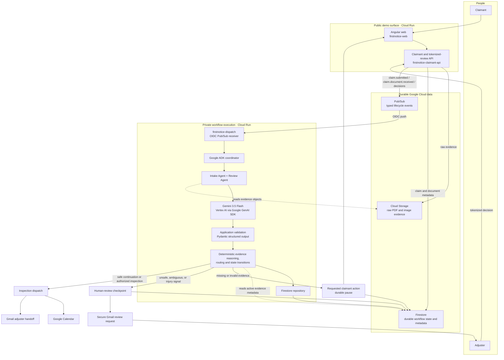
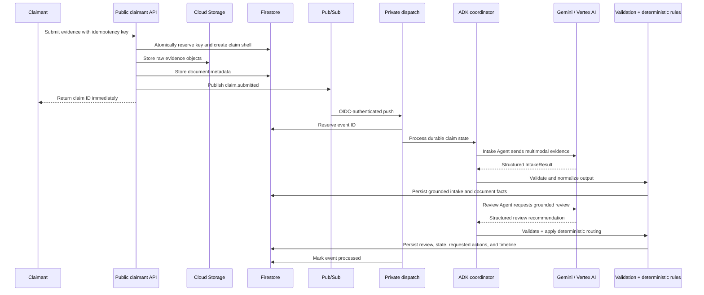
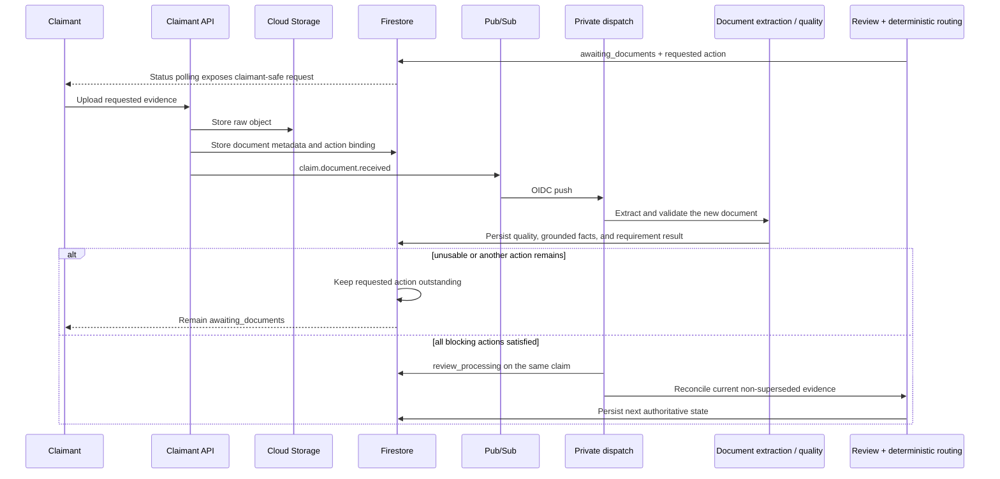
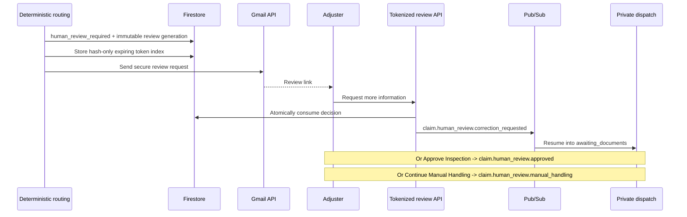
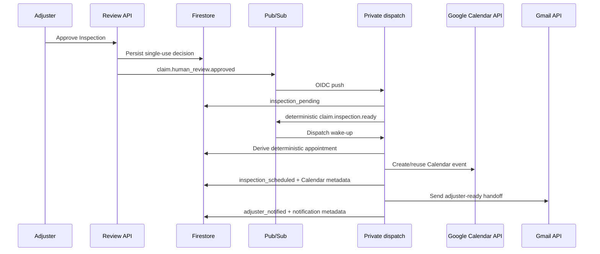

# FirstNotice Dispatch Architecture

## 1. System overview

FirstNotice Dispatch is a durable, event-driven coordinator for the first mile of an auto-insurance claim. A browser request establishes claim and evidence records; typed Pub/Sub events wake a private processor; Google ADK coordinates bounded intake and review stages; Gemini 3.5 Flash on Vertex AI returns structured extraction or review output; application services validate that output; and deterministic Python owns consequential routing and state transitions.

Firestore is the workflow source of truth. Cloud Storage holds raw evidence separately. A browser, model response, or Pub/Sub delivery never directly changes the legal workflow state without passing through application validation and repository persistence.

The concise project diagram and rendered artifacts are in
[`docs/architecture/`](architecture/firstnotice-architecture.md).

## 2. Component responsibilities

| Component | Responsibility | Boundary |
|---|---|---|
| Angular web (`firstnotice-web`) | Claim submission, status polling, requested evidence upload, curated activity, and tokenized adjuster review | Public Cloud Run; contains no Google credentials |
| Claimant API (`firstnotice-claimant-api`) | Validates browser requests, reserves idempotency keys, stores evidence, creates durable records, publishes typed events, and serves token-scoped review operations | Public demo Cloud Run; does not expose `/events/pubsub` |
| Cloud Storage | Stores raw PDF/image evidence objects | Raw bytes stay out of Firestore and Pub/Sub |
| Pub/Sub | Delivers typed lifecycle events to private processing | OIDC-authenticated push to private dispatch |
| Dispatch (`firstnotice-dispatch`) | Receives `/events/pubsub`, reserves event processing, invokes the eligible workflow, and records completion/failure | Private Cloud Run; no `allUsers` invoker |
| Google ADK coordinator | Routes durable claim states to bounded Intake Agent, Review Agent, wait, or dispatch actions | Coordinates stages; does not replace deterministic state rules |
| Intake Agent and application service | Sends submitted multimodal evidence to Gemini and validates the structured `IntakeResult` | Model output is not persisted until application validation succeeds |
| Review Agent and application service | Obtains grounded quality/completeness/conflict analysis and validates the structured review result | Recommendations are advisory to deterministic routing |
| Deterministic evidence/routing services | Apply evidence requirements, active-artifact reasoning, safety escalation, legal state transitions, and allowed claimant actions | Authoritative for workflow routing |
| Firestore repository | Persists claims, document metadata, requested actions, human-review generations, events/idempotency, appointments, and notifications | Durable pause/resume source of truth |
| Human-review service | Creates expiring hash-only review tokens and accepts an allowlisted decision | Adjuster can request information, authorize inspection, or continue manual handling |
| Dispatch workflow | Selects the deterministic inspection slot, persists the appointment, creates the Calendar event, drafts the handoff, and sends Gmail | Operational handoff only; no claim adjudication |

## 3. High-level topology

There is deliberately no Gemini-to-Firestore edge. Gemini responses pass through typed application validation and deterministic logic before repository writes.

## 4. Submission, Intake, and Review

Gemini extracts and reasons. Pydantic models reject malformed provider output. Deterministic code evaluates current active evidence, evidence requirements, injury/safety signals, and allowed transitions before Firestore is updated.

## 5. Claimant remediation and automatic resume

Missing or unusable evidence is a durable workflow pause, not a new claim or synchronous loop.

One artifact may satisfy multiple compatible requirements. A validated, server-authorized replacement can supersede its target while retaining the old document in audit history. Unusable uploads do not fulfill an action or trigger Review. Redelivered document events are idempotent.

Medical documents are different: `medical_document` is accepted only as supporting material for a human reviewer. FirstNotice does not ask Gemini to infer diagnosis, causation, severity, prognosis, coverage, or payout from that attachment, and a durable positive injury signal is not cleared by its upload.

## 6. Human review

Human review is used when deterministic rules cannot formulate a safe autonomous claimant action, or when an injury/safety boundary requires human judgment.

- **Request more information** creates one allowlisted claimant action and returns the same claim to `awaiting_documents`.
- **Approve Inspection** authorizes only the physical-inspection step. It cannot bypass unresolved evidence.
- **Continue Manual Handling** records an explicit manual-handling decision while the claim remains at the human-review boundary; the claimant sees that no action is currently required.
- Every legitimate new review generation receives a new token and notification; an old consumed token is not reused.

## 7. Inspection, Calendar, and Gmail handoff

After autonomous intake is complete, the claim reaches `inspection_ready`. A secure adjuster decision authorizes the physical inspection. Durable `inspection_pending` state then produces the deterministic `claim.inspection.ready` boundary.

Calendar records the inspection directly on the configured secondary calendar. It uses a deterministic event ID, has no attendees, and uses `sendUpdates=none`. Gmail independently sends the review request and final handoff.

## 8. Persistence boundaries

Firestore stores structured state and metadata, including:

- claim status and validated intake/review results;
- document metadata, grounded facts, quality, requested-action binding, and supersession relationships;
- outstanding requested actions and review generations;
- claimant and technical timeline events;
- processed-event attempts and idempotency reservations;
- human-review decisions and hash-only token lookup records;
- appointment/Calendar metadata; and
- notification/Gmail metadata.

Cloud Storage stores raw image and PDF evidence under claim/document-scoped object paths. Pub/Sub carries event and document identifiers, not evidence bytes. Application services load only the evidence required for the eligible stage.

## 9. Deterministic safety authority

Gemini can extract facts, assess quality, identify potential conflicts, and recommend a next step. It cannot directly:

- choose a legal claim-state transition;
- authorize a replacement target supplied by a browser or model;
- clear durable injury/safety indicators;
- force inspection while evidence remains unresolved; or
- create a coverage, liability, fraud, payout, or settlement decision.

Deterministic application code owns those decisions using validated provider output, current active evidence, persisted provenance, and the transition graph in `backend/app/domain/claim_status.py`.

## 10. Idempotency and failure recovery

The design uses at-least-once delivery with idempotent effects:

1. The API hashes and atomically reserves the claimant submission key.
2. Pub/Sub delivery is reserved in `processed_events` before work begins.
3. Completed or already-processing redeliveries become no-ops; retryable failures may reclaim the same event.
4. Document resume, requested-action consumption, and supersession use durable reservations/transactions.
5. Inspection-ready, appointment, Calendar, review-generation, and notification identities derive from stable workflow keys.
6. Calendar duplicate creation reuses the deterministic event.
7. Firestore is reloaded before emitting the next durable event boundary.

Pub/Sub is the outer recovery boundary for provider or integration failures. The stable Phase 1 architecture does not claim application-configured multi-attempt Gemini retries, per-attempt provider hooks, compact resumed Review, or global exactly-once delivery.

## 11. Cloud Run and trust boundaries

| Service | Exposure | Identity |
|---|---|---|
| `firstnotice-web` | Public static Angular/nginx service | No application credentials configured |
| `firstnotice-claimant-api` | Public controlled-demo API | Runtime service identity for Firestore, GCS, and Pub/Sub |
| `firstnotice-dispatch` | Private Pub/Sub receiver and workflow processor | Runtime service identity; only dedicated push identity has Cloud Run Invoker |

The public claimant service has explicit CORS but no consumer authentication. This is an intentional limitation of the current demonstration deployment. Production requires appropriate consumer authentication and claim-level authorization. Review capabilities are random, expiring, single-use, and stored only as hashes. Gmail OAuth values are supplied only to private dispatch through Secret Manager; Google Cloud access otherwise uses workload identity or local ADC.

## 12. Explicit non-goals

FirstNotice performs intake, evidence coordination, operational routing, inspection scheduling, and adjuster handoff. It does **not** autonomously:

- approve or deny an insurance claim;
- determine coverage;
- determine liability;
- conclude fraud;
- calculate payout or settlement;
- make a medical diagnosis; or
- infer medical causation, severity, or prognosis.

`adjuster_notified` means the FirstNotice intake orchestration completed. It does not mean the insurance claim was adjudicated.
