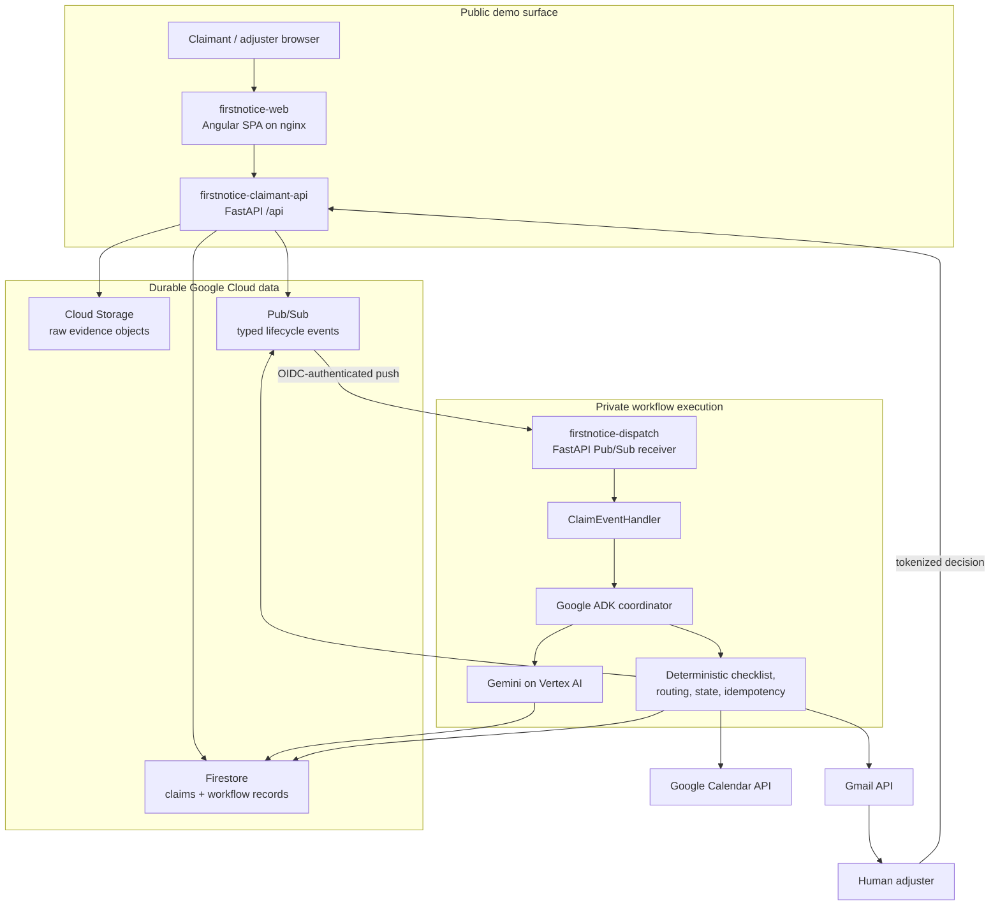
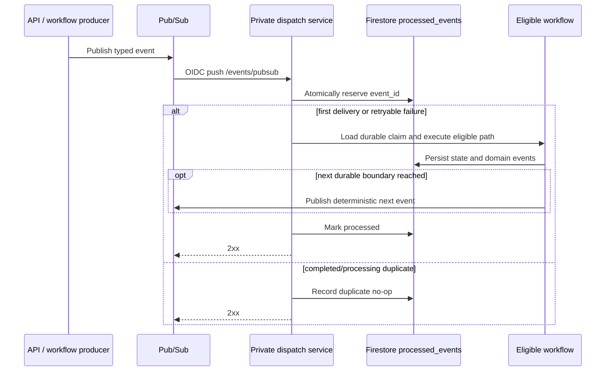
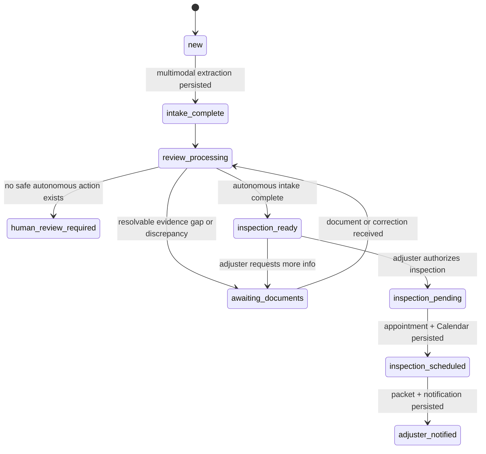
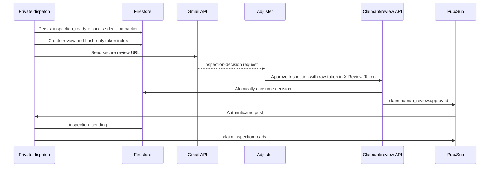
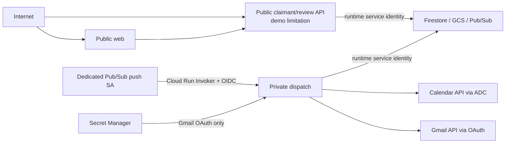

# FirstNotice Dispatch Architecture

## 1. High-level architecture

FirstNotice is a durable event-driven coordinator. Browser requests establish claim state and evidence; Pub/Sub wakes a private processor; Gemini and ADK perform bounded reasoning; deterministic code owns routing and external actions.



## 2. Deployed Cloud Run topology

| Service | Exposure | Entry point | Responsibility | Identity |
|---|---|---|---|---|
| `firstnotice-web` | Public | nginx on port 8080 | Serves Angular and generates non-secret runtime `config.js` | Default compute identity; no application credentials configured |
| `firstnotice-claimant-api` | Public demo API | `uvicorn claimant_main:app` | Claim submission/status/events/evidence and tokenized review routes under `/api` | `firstnotice-runtime@firstnotice-ai.iam.gserviceaccount.com` |
| `firstnotice-dispatch` | Private | `uvicorn main:app` | Receives `/events/pubsub` and executes workflows/external actions | `firstnotice-runtime@firstnotice-ai.iam.gserviceaccount.com` |

Verified IAM boundary on August 7, 2026:

- `firstnotice-web`: `allUsers` has Cloud Run Invoker.
- `firstnotice-claimant-api`: `allUsers` has Cloud Run Invoker.
- `firstnotice-dispatch`: only `firstnotice-pubsub-push@firstnotice-ai.iam.gserviceaccount.com` has Cloud Run Invoker; there is no `allUsers` binding.
- `firstnotice-claim-events-push` targets the private service’s `/events/pubsub` endpoint with that push identity.

The public claimant app is deliberately constructed without the Pub/Sub receiver route. nginx also returns 404 for `/api/` and `/events/` on the static web service.

## 3. Data and storage architecture

```text
claim_submission_keys/{sha256(clientKey)}
  claim_id, event_id, correlation_id, status, timestamps

claims/{claimId}
  structured intake, current status, review result, counters,
  dispatch metadata, created_at, updated_at, workflow_version

claims/{claimId}/documents/{documentId}
  filename, MIME type, size, GCS URI, evidence type/capabilities,
  validation status, replacement/resume metadata

claims/{claimId}/events/{eventId}
  claimant/judge timeline and technical workflow events

claims/{claimId}/processed_events/{eventId}
  event type/version, attempt state, duplicate/retry outcome

claims/{claimId}/human_reviews/{reviewId}
  briefing, conflicts, expiration, decision and notification state

claims/{claimId}/appointments/{appointmentId}
  deterministic slot and Google Calendar metadata

claims/{claimId}/notifications/{notificationId}
  adjuster handoff status and Gmail delivery metadata

human_review_tokens/{sha256(token)}
  claim/review lookup, expiration, status; never the raw token

gs://<evidence-bucket>/claims/{claimId}/documents/{documentId}/{filename}
  raw image, PDF, or audio evidence
```

Firestore is the workflow source of truth. Raw evidence bytes never enter Firestore or Pub/Sub. Pub/Sub events contain identifiers needed to reload durable state.

## 4. Event model

All lifecycle events use a discriminated Pydantic contract with:

- `event_id`
- `event_type`
- `event_version`
- `claim_id`
- UTC `occurred_at`
- `correlation_id`
- `source`
- a type-specific minimal payload



Recognized event types:

- `claim.submitted`
- `claim.document.received`
- `claim.human_review.approved`
- `claim.human_review.correction_requested`
- `claim.correction.received`
- `claim.inspection.ready`

## 5. State machine



Only transitions in `backend/app/domain/claim_status.py` are legal. AI output cannot bypass that graph.

## 6. Agent responsibilities

### Intake Agent

`IntakeSpecialistAgent` delegates multimodal extraction to the existing `IntakeExtractionService`. Gemini sees evidence filenames plus image/PDF/audio parts and returns the `IntakeResult` schema.

### Review Agent

`ReviewSpecialistAgent` delegates review to the workflow tool adapter. Gemini identifies grounded quality/completeness/conflict observations; Python reconstructs authoritative checklist gaps, verifies conflict grounding, applies safety escalation order, and chooses the permitted operational target.

### ADK coordinator

`FirstNoticeCoordinatorAgent` reads durable state and selects a bounded action: intake, review, wait for claimant evidence, wait for an inspection decision, dispatch, or complete. The event handler creates the secure decision checkpoint at durable `inspection_ready` and publishes dispatch work only after approval produces durable `inspection_pending`.

### Deterministic services

- Claim-state transition validation
- Required-evidence evaluation
- Evidence-request consolidation
- Event idempotency and retries
- Inspection slot selection and appointment identity
- Calendar event identity
- Review token lifecycle
- Dispatch completion

## 7. Missing-document pause and resume

```mermaid
sequenceDiagram
    participant C as Claimant
    participant API as Claimant API
    participant FS as Firestore / GCS
    participant PS as Pub/Sub
    participant D as Private dispatch
    participant G as Gemini review

    C->>API: Submit description + damage image (+ optional evidence)
    API->>FS: Reserve key, store claim/evidence metadata + objects
    API->>PS: claim.submitted
    PS->>D: Authenticated push
    D->>G: Intake + evidence review
    D->>FS: status = awaiting_documents; requested evidence
    C->>API: Upload requested document
    API->>FS: Store new object and document metadata
    API->>PS: claim.document.received(document_id)
    PS->>D: Authenticated push
    D->>G: Inspect newly uploaded document
    D->>FS: Mark all supported compatible requirements satisfied
    D->>FS: Resume review on the same claim
    alt still incomplete
        D->>FS: awaiting_documents
    else ready
        D->>FS: inspection_ready
        D->>GM: secure inspection-decision request
    end
```

Multiple internal requirements can map to one claimant-facing artifact. A readable license-plate image can satisfy both `license_plate_photo` and `vehicle_identity`.

## 8. Inspection decision and claimant override



Approval authorizes physical inspection only. It is not a coverage, liability, payout, fraud, approval, or denial decision. Request More Info maps untrusted prose into one allowlisted text or document action and returns the same claim to `awaiting_documents`.

## 9. Calendar and Gmail actions

When a durable claim is `inspection_pending`, `claim.inspection.ready` invokes the existing dispatch workflow:

1. Derive a deterministic appointment and select a slot.
2. Create a private Google Calendar event using a stable base32hex-compatible event ID and `sendUpdates=none`.
3. Persist the appointment and move to `inspection_scheduled`.
4. Build the adjuster-ready packet and use Gemini for a constrained notification draft.
5. Send the final Gmail message separately.
6. Persist notification metadata and move to `adjuster_notified`.

Calendar records the inspection; Gmail communicates with the adjuster. Calendar does not add an attendee or send an invitation.

### Dedicated adjuster-owned Calendar

The deployed Calendar ID may refer to any secondary calendar that the Cloud Run runtime identity can edit; the adapter does not assume a calendar owner or derive the Calendar ID from an email address. For the hackathon demo:

1. Sign in to the dedicated `firstnotice.adjuster@gmail.com` account.
2. Create the secondary calendar **FirstNotice Demo Inspections**.
3. Share it with `firstnotice-runtime@firstnotice-ai.iam.gserviceaccount.com`.
4. Grant **Make changes to events**.
5. Copy its Calendar ID and set it as `GOOGLE_CALENDAR_ID` on `firstnotice-dispatch`.

The runtime service account authenticates to Calendar through ADC and creates the event directly on that shared secondary calendar. The payload deliberately contains no `attendees`, and the request uses `sendUpdates=none`.

Gmail is independent: its OAuth configuration sends the final handoff to `ADJUSTER_EMAIL=firstnotice.adjuster@gmail.com`. Using the same dedicated demo account makes both external actions easy to verify without coupling their implementations or inviting the adjuster to an event already owned by that account.

## 10. Reliability and idempotency

- Submission reservation and claim shell creation share an atomic Firestore batch.
- The raw browser idempotency key is hashed before persistence.
- Event reservation uses Firestore create preconditions.
- Retryable failures can reclaim the same processed-event record and increment attempts.
- Duplicate completed/processing events return a successful no-op.
- The event handler reconciles the inspection-ready boundary even during duplicate recovery.
- Resume records attach deterministic document/idempotency metadata.
- Scheduling, Calendar event, notification, and human-review identities are deterministic per claim/workflow version.
- Firestore batches couple key state changes with timeline events.
- Calendar 409 handling reads and reuses the existing event.
- Gmail has a deterministic RFC message ID and persisted notification check, but provider acceptance and Firestore persistence cannot be one transaction. A crash in that gap can produce a duplicate send on retry.

The design targets safe at-least-once event processing with idempotent effects; it does not claim global exactly-once delivery.

## 11. Security boundaries



- No service-account key file is required; Google Cloud access uses service identity or ADC locally.
- Gmail OAuth secrets are absent from the public API and web service.
- Review tokens expire, are stored only as hashes, and are single-use for decision processing.
- The claimant timeline exposes curated structured events, not raw Pub/Sub payloads or evidence.
- The public demo API has explicit CORS but no claimant authentication. That is the primary intentional demo security limitation.
