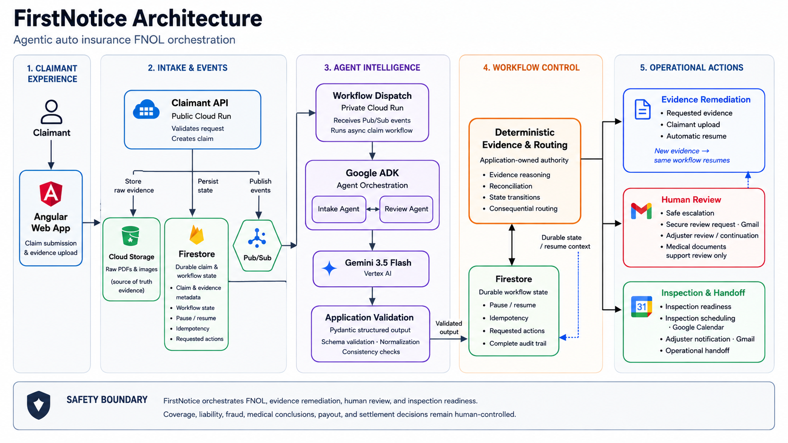

# FirstNotice Architecture

FirstNotice is an event-driven auto-insurance FNOL coordinator. A claimant submits evidence once; public Cloud Run services accept it durably; Pub/Sub wakes a private processor; Google ADK coordinates bounded Intake and Review work; Gemini returns structured reasoning; and deterministic application logic decides whether the claim can continue, must pause for more evidence, or requires human review.

## Architecture at a glance



## Vector source

The PNG and PDF artifacts are rendered from this standards-based SVG source.

```svg
<svg xmlns="http://www.w3.org/2000/svg" width="1920" height="1080" viewBox="0 0 1920 1080" role="img" aria-labelledby="title desc">
  <title id="title">FirstNotice Architecture</title>
  <desc id="desc">Agentic auto insurance FNOL orchestration from claimant intake through agent intelligence, deterministic workflow control, evidence remediation, human review, and inspection handoff.</desc>
  <defs>
    <filter id="shadow" x="-25%" y="-25%" width="150%" height="150%">
      <feDropShadow dx="0" dy="4" stdDeviation="6" flood-color="#0f172a" flood-opacity="0.08"/>
    </filter>
    <marker id="arrow" markerWidth="10" markerHeight="10" refX="8" refY="3" orient="auto" markerUnits="strokeWidth">
      <path d="M0,0 L0,6 L9,3 z" fill="#64748b"/>
    </marker>
    <marker id="arrow-blue" markerWidth="10" markerHeight="10" refX="8" refY="3" orient="auto" markerUnits="strokeWidth">
      <path d="M0,0 L0,6 L9,3 z" fill="#2563eb"/>
    </marker>
    <style>
      .title { font: 700 40px Arial, sans-serif; fill: #0f172a; }
      .subtitle { font: 400 22px Arial, sans-serif; fill: #475569; }
      .column { fill: #f8fafc; stroke: #cbd5e1; stroke-width: 2; }
      .column-title { font: 700 17px Arial, sans-serif; letter-spacing: 1.2px; fill: #334155; }
      .box-title { font: 700 21px Arial, sans-serif; fill: #0f172a; }
      .box-copy { font: 400 17px Arial, sans-serif; fill: #334155; }
      .small { font: 400 15px Arial, sans-serif; fill: #475569; }
      .edge { fill: none; stroke: #64748b; stroke-width: 3; marker-end: url(#arrow); }
      .edge-dashed { fill: none; stroke: #2563eb; stroke-width: 3; stroke-dasharray: 10 8; marker-end: url(#arrow-blue); }
      .edge-label { font: 600 15px Arial, sans-serif; fill: #475569; }
      .footer-title { font: 700 18px Arial, sans-serif; fill: #334155; }
      .footer-copy { font: 400 17px Arial, sans-serif; fill: #475569; }
    </style>
  </defs>

  <rect width="1920" height="1080" fill="#ffffff"/>
  <text class="title" x="52" y="65">FirstNotice Architecture</text>
  <text class="subtitle" x="52" y="105">Agentic auto insurance FNOL orchestration</text>

  <!-- Five conceptual columns -->
  <rect class="column" x="50" y="150" width="240" height="720" rx="18"/>
  <rect class="column" x="315" y="150" width="310" height="720" rx="18"/>
  <rect class="column" x="650" y="150" width="390" height="720" rx="18"/>
  <rect class="column" x="1065" y="150" width="305" height="720" rx="18"/>
  <rect class="column" x="1395" y="150" width="475" height="720" rx="18"/>

  <text class="column-title" x="170" y="192" text-anchor="middle">CLAIMANT</text>
  <text class="column-title" x="470" y="192" text-anchor="middle">INTAKE &amp; EVENTS</text>
  <text class="column-title" x="845" y="192" text-anchor="middle">AGENT INTELLIGENCE</text>
  <text class="column-title" x="1218" y="192" text-anchor="middle">WORKFLOW CONTROL</text>
  <text class="column-title" x="1633" y="192" text-anchor="middle">OPERATIONAL ACTIONS</text>

  <!-- Claimant -->
  <rect x="88" y="300" width="164" height="66" rx="33" fill="#ffffff" stroke="#334155" stroke-width="3"/>
  <text class="box-title" x="170" y="341" text-anchor="middle">Claimant</text>

  <rect x="72" y="475" width="196" height="104" rx="14" fill="#e0f2fe" stroke="#0284c7" stroke-width="3" filter="url(#shadow)"/>
  <text class="box-title" x="170" y="516" text-anchor="middle">Angular</text>
  <text class="box-copy" x="170" y="547" text-anchor="middle">claimant UI</text>
  <path class="edge" d="M170 366 V475"/>

  <!-- Intake and events -->
  <rect x="355" y="265" width="230" height="100" rx="14" fill="#e0f2fe" stroke="#0284c7" stroke-width="3" filter="url(#shadow)"/>
  <text class="box-title" x="470" y="307" text-anchor="middle">Claimant API</text>
  <text class="box-copy" x="470" y="338" text-anchor="middle">Cloud Run</text>

  <rect x="333" y="468" width="132" height="116" rx="14" fill="#ecfdf5" stroke="#059669" stroke-width="3"/>
  <text class="box-title" x="399" y="510" text-anchor="middle">Cloud</text>
  <text class="box-title" x="399" y="537" text-anchor="middle">Storage</text>
  <text x="399" y="565" text-anchor="middle" font-family="Arial" font-size="13" fill="#475569">Raw PDFs &amp; images</text>

  <path d="M510 468 H580 L604 526 L580 584 H510 L486 526 Z" fill="#ecfdf5" stroke="#059669" stroke-width="3"/>
  <text class="box-title" x="545" y="518" text-anchor="middle">Pub/Sub</text>
  <text class="small" x="545" y="548" text-anchor="middle">typed events</text>

  <path class="edge" d="M470 365 V415 H399 V468"/>
  <path class="edge" d="M470 415 H545 V468"/>
  <text class="edge-label" x="374" y="421">store</text>
  <text class="edge-label" x="552" y="421">publish</text>

  <!-- Agent intelligence -->
  <rect x="715" y="265" width="260" height="88" rx="14" fill="#eef2ff" stroke="#4f46e5" stroke-width="3" filter="url(#shadow)"/>
  <text class="box-title" x="845" y="304" text-anchor="middle">Private dispatch</text>
  <text class="box-copy" x="845" y="334" text-anchor="middle">Cloud Run · OIDC</text>

  <rect x="690" y="422" width="310" height="228" rx="18" fill="#f5f3ff" stroke="#7c3aed" stroke-width="3"/>
  <text class="box-title" x="845" y="459" text-anchor="middle">Google ADK</text>
  <rect x="712" y="485" width="126" height="65" rx="11" fill="#ffffff" stroke="#7c3aed" stroke-width="2"/>
  <rect x="852" y="485" width="126" height="65" rx="11" fill="#ffffff" stroke="#7c3aed" stroke-width="2"/>
  <text class="box-copy" x="775" y="525" text-anchor="middle">Intake Agent</text>
  <text class="box-copy" x="915" y="525" text-anchor="middle">Review Agent</text>
  <rect x="748" y="570" width="194" height="62" rx="11" fill="#eef2ff" stroke="#4f46e5" stroke-width="2"/>
  <text class="box-title" x="845" y="597" text-anchor="middle">Gemini 3.5 Flash</text>
  <text class="small" x="845" y="619" text-anchor="middle">Vertex AI</text>

  <rect x="720" y="733" width="250" height="92" rx="14" fill="#f5f3ff" stroke="#7c3aed" stroke-width="3" filter="url(#shadow)"/>
  <text class="box-title" x="845" y="772" text-anchor="middle">Application validation</text>
  <text class="box-copy" x="845" y="803" text-anchor="middle">Pydantic structured output</text>

  <path class="edge" d="M845 353 V422"/>
  <path class="edge" d="M845 650 V733"/>

  <!-- Cross-boundary intake paths -->
  <path class="edge" d="M268 527 H302 V315 H355"/>
  <path class="edge" d="M545 584 V610 H680 V309 H715"/>
  <text class="edge-label" x="610" y="600">OIDC push</text>
  <path class="edge-dashed" d="M399 468 V400 H740 V422"/>
  <text class="edge-label" x="515" y="389">Active evidence context</text>

  <!-- Workflow control -->
  <rect x="1110" y="273" width="215" height="156" rx="18" fill="#ecfdf5" stroke="#059669" stroke-width="3" filter="url(#shadow)"/>
  <text class="box-title" x="1218" y="315" text-anchor="middle">Firestore</text>
  <text class="box-copy" x="1218" y="348" text-anchor="middle">durable claim state</text>
  <text class="small" x="1218" y="381" text-anchor="middle">pause · resume</text>
  <text class="small" x="1218" y="406" text-anchor="middle">idempotency</text>

  <rect x="1090" y="652" width="255" height="158" rx="18" fill="#fff7ed" stroke="#ea580c" stroke-width="5" filter="url(#shadow)"/>
  <text class="box-title" x="1218" y="698" text-anchor="middle">Deterministic authority</text>
  <text class="box-copy" x="1218" y="734" text-anchor="middle">evidence reasoning</text>
  <text class="box-copy" x="1218" y="764" text-anchor="middle">&amp; consequential routing</text>
  <text class="small" x="1218" y="793" text-anchor="middle">application-owned decisions</text>

  <path class="edge" d="M970 779 H1090"/>
  <text class="edge-label" x="995" y="765">validated</text>
  <path class="edge" d="M1218 652 V429"/>
  <text class="edge-label" x="1232" y="552">persist</text>

  <!-- Operational actions -->
  <rect x="1435" y="235" width="395" height="142" rx="18" fill="#eff6ff" stroke="#2563eb" stroke-width="4" filter="url(#shadow)"/>
  <text x="1465" y="273" font-family="Arial" font-size="18" font-weight="700" fill="#1e3a8a">EVIDENCE REMEDIATION</text>
  <text class="box-title" x="1465" y="309">Requested evidence</text>
  <text class="box-copy" x="1465" y="341">New evidence → same workflow resumes</text>

  <rect x="1435" y="429" width="395" height="150" rx="18" fill="#fff1f2" stroke="#e11d48" stroke-width="4" filter="url(#shadow)"/>
  <text x="1465" y="468" font-family="Arial" font-size="18" font-weight="700" fill="#881337">HUMAN REVIEW</text>
  <text class="box-title" x="1465" y="505">Safe escalation</text>
  <text class="box-copy" x="1465" y="537">Secure review request · Gmail</text>
  <text class="small" x="1465" y="562">Adjuster review / continuation · medical support only</text>

  <rect x="1435" y="631" width="395" height="150" rx="18" fill="#ecfdf5" stroke="#059669" stroke-width="4" filter="url(#shadow)"/>
  <text x="1465" y="670" font-family="Arial" font-size="18" font-weight="700" fill="#064e3b">INSPECTION &amp; HANDOFF</text>
  <text class="box-title" x="1465" y="707">Inspection readiness</text>
  <text class="box-copy" x="1465" y="739">Inspection scheduling · Google Calendar</text>
  <text class="small" x="1465" y="765">Adjuster notification · Gmail</text>

  <!-- Three explicit deterministic outcomes -->
  <path d="M1345 731 H1395 V306 H1435" class="edge"/>
  <path d="M1395 504 H1435" class="edge"/>
  <path d="M1395 706 H1435" class="edge"/>

  <!-- Safety boundary footer -->
  <rect x="50" y="910" width="1820" height="120" rx="18" fill="#f8fafc" stroke="#94a3b8" stroke-width="2"/>
  <text class="footer-title" x="85" y="954">SAFETY BOUNDARY</text>
  <text class="footer-copy" x="85" y="987">FirstNotice orchestrates FNOL and inspection readiness. Coverage, liability, fraud, medical conclusions,</text>
  <text class="footer-copy" x="85" y="1016">payout, and settlement decisions remain outside autonomous authority.</text>
</svg>
```

## Key boundaries

- **Model versus authority:** Gemini extracts and reasons; application validation and deterministic logic own consequential routing and state transitions.
- **Evidence versus metadata:** raw PDF/image evidence stays in Cloud Storage; Firestore holds durable workflow state, grounded metadata, requested actions, review generations, events/idempotency, appointments, and notifications.
- **Durable pause/resume:** claimant evidence and adjuster decisions publish events that resume the same Firestore-backed claim.
- **Human safety:** ambiguity, safety concerns, or injury signals stop autonomous continuation. Medical documents are supporting human-review material only.
- **Operational scope:** FirstNotice coordinates intake, inspection, Calendar scheduling, and Gmail handoff. It does not decide coverage, liability, fraud, payout, settlement, or medical conclusions.
